# OPT IN OUT - Projeto de Tópicos avançados de banco de dados - Banco de dados - FATEC 2022

## Proposta

O seguinte projeto tem como objetivo atender a LGPD (Lei geral da proteção de dados), apresentando uma solução de configurações de meios de comunicação que um determinado usuário aceita receber de uma plataforma (Opt In-out). Além disso, a solução deverá apresentar um histórico dessas configurações por usuário, descrevendo qual a versão do termo aceito pelo usuário, no momento do seu registro no sistema, e quais foram as opções de comunicação aceitas, ou não, no momento em que este usuário se registrou ou fez alguma alteração em seus dados e preferências.

## Regras do projeto

- Toda criação ou alteração de usuário irá gerar um registro na coleção Histórico;
- O termo ativo será o último cadastrado no banco de dados;
- No momento da criação ou edição do usuário, é necessário passar a versão do termo que ele está aceitando;
- Dentro da coleção de históricos, deve ser mantida as novas configurações e qual a versão aceita pelo usuário.

## Arquitetura do projeto

O projeto foi desenvolvido em Node (Javascript) e com MongoDB como banco de dados.

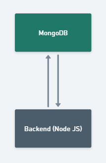

## Schemas do banco de dados

Para realização do projeto, foi utilizado 3 schemas dentro do MongoDB:

- Usuário;
- Termo;
- Histórico.

### Schema Usuário

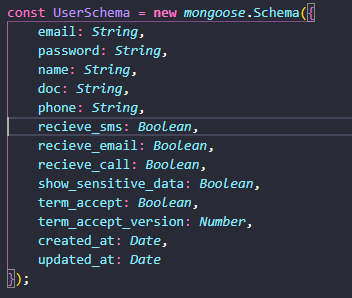

### Schema Termo

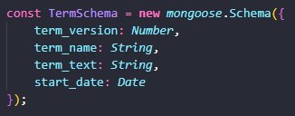

### Schema Histórico

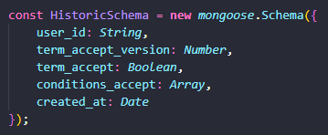

**Por se tratar de um banco não relacional, não existe relacionamento entre os schemas, entretanto, no instante em que se cria ou edita um usuário, é feito uma inserção na coleção de históricos, dentro do mongoDB, onde é registrado o histórico de alteração junto do id do usuário.**

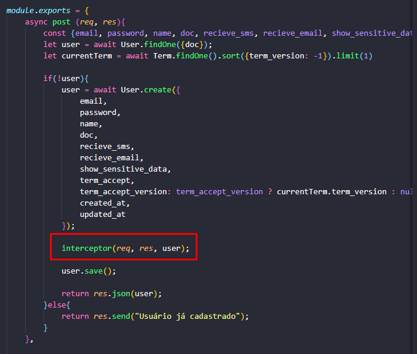

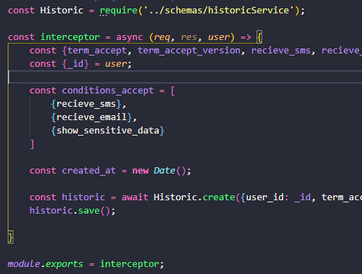

## APIs

Abaixo, a lista de APIs que o projeto disponibiliza para seu consumo.

_endereco_do_ambiente_ = Url onde o ambiente está disponível.

_id_ = Id do usuário.

### GET Termo

```
<endereco_do_ambiente>/term/get/active
```

Retorna o termo ativo.

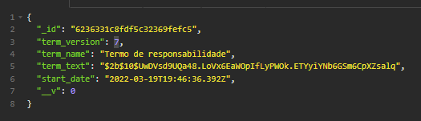

### GET Usuário

```
<endereco_do_ambiente>/users/<id>
```

Retorna o usuário por ID. Este retorno pode variar conforme a configuração do usuário. Se o usuário optar por não exibir os dados sensíveis dele, alguns dados serão mascarados no momento da consulta.

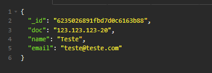

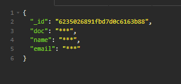

### GET Todos os usuários

```
<endereco_do_ambiente>/get/all
```

Retorna uma lista (array) com todos os usuários cadastrados.

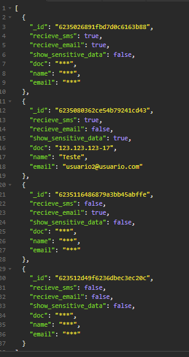

### GET Todos os históricos de alteração

```
<endereco_do_ambiente>/historics
```

Retorna uma lista (array) com todos os históricos de alterações de configurações dos usuários registradas no banco.

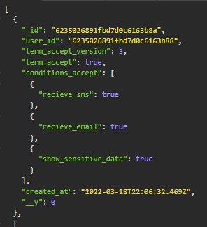

### GET Históricos de alteração por usuário

```
<endereco_do_ambiente>/historics/<id>
```

Retorna uma lista (array) com todos os históricos de alterações de um usuário do banco.


### Post Termo

Por padrão, o último termo cadastrado será o termo ativo dentro do sistema, sendo assim, seu versionamento será incrementado.

```
<endereco_do_ambiente>/term/new
```

**Corpo da requisição**

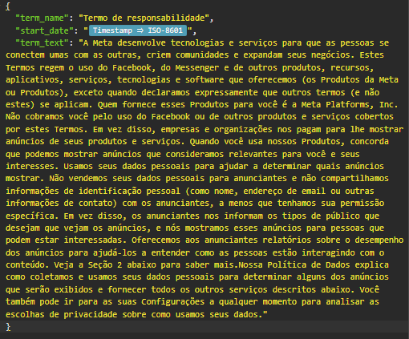

Retorna o registro do termo no banco, com seu conteúdo criptografado.

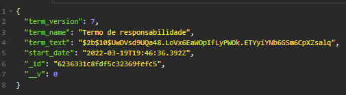

### Post Validação do termo ativo

```
<endereco_do_ambiente>/term/validate
```

**Corpo da requisição**

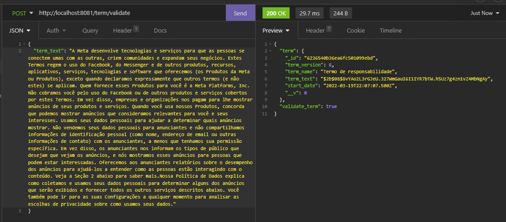

Retorna o termo junto da sua validação de conteúdo. Caso haja alterações, o termo será invalidado.

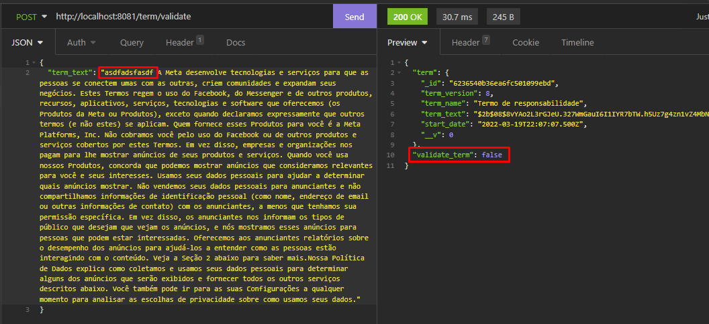

### Post Usuário

```
<endereco_do_ambiente>/users/new
```

**Corpo da requisição**

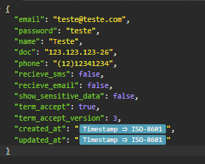

Retorna os dados do usuário criado.

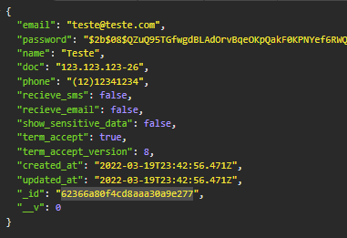

### Put Usuário

```
<endereco_do_ambiente>/users/edit/<id>
```

**Corpo da requisição**


Retorna mensagem de sucesso.

### Post Busca de usuários que aceitam receber emails e SMS

```
<endereco_do_ambiente>/users/recieveNotifications
```

**Corpo da requisição**

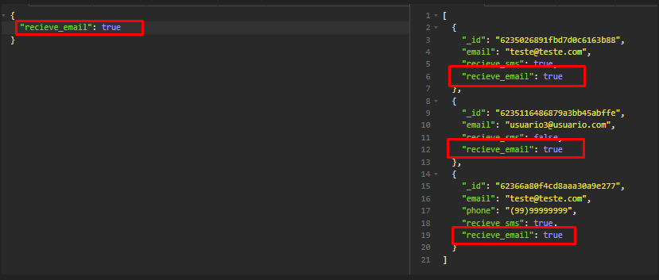

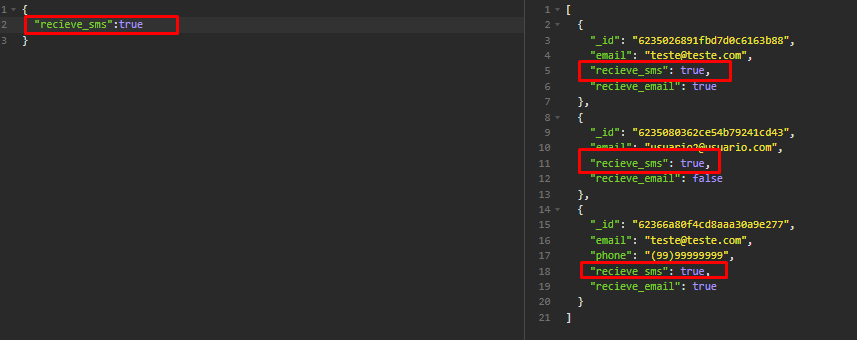

Retorna uma lista de usuários que aceitam receber contato através do canal buscado.

## Rodando o projeto

Dentro da pasta _./back_.

```
npm install - instalar dependências do Node
npm start - rodar o projeto
```

O backend será iniciado em http://localhost:8081

## Estrutura de pastas

```
projeto
│   README.md
│   .gitignore
│___assets
|   |   *.png
|   |   ...
└───back
│   │   .env
│   │   package-lock.json
|   |   package.json
│   │
│   └───src
│       │   routes.js
│       │   server.js
│       │___controller
|       |   |   historicController.js
|       |   |   termController.js
|       |   |   userController.js
│       |___schemas
|       |   |   historicSchema.js
|       |   |   termSchema.js
|       |   |   userSchema.js
|       |___utils
|           |   interceptor.js
```

# Lista de bibliotecas usadas

- express: Framework para criação de aplicações web com APIs;
- mongoose: Framework para conexão e operações dentro do MongoDB;
- bcrypt: Biblioteca para criações de hash. 


