# OPT IN OUT - Projeto LAB VI - Banco de dados

## Proposta

O seguinte projeto tem como objetivo atender a LGPD (Lei geral da proteção de dados), apresentando uma solução de configurações de meios de comunicação que um determinado usuário aceita receber de uma plataforma (Opt In-out). Além disso, a solução deverá apresentar um histórico dessas configurações por usuário, descrevendo qual a versão do termo aceito pelo usuário, no momento do seu registro no sistema, e quais foram as opções de comunicação aceitas, ou não, no momento em que este usuário se registrou ou fez alguma alteração em seus dados e preferências.

## Arquitetura do projeto

O projeto foi desenvolvido em Node (Javascript) e com MongoDB como banco de dados.

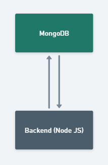

## Schemas do banco de dados

Para realização do projeto, foi utilizado 3 schemas dentro do MongoDB:

- Usuário;
- Termo;
- Histórico.

### Schema Usuário

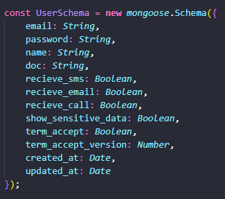

### Schema Termo

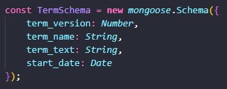

### Schema Histórico

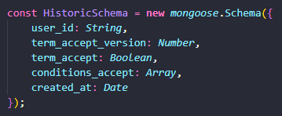

**Por se tratar de um banco não relacional, não existe relacionamento entre os schemas, entretanto, no instante em que se cria ou edita um usuário, é feito uma inserção na coleção de históricos, dentro do mongoDB, onde é registrado o histórico de alteração junto do id do usuário.**

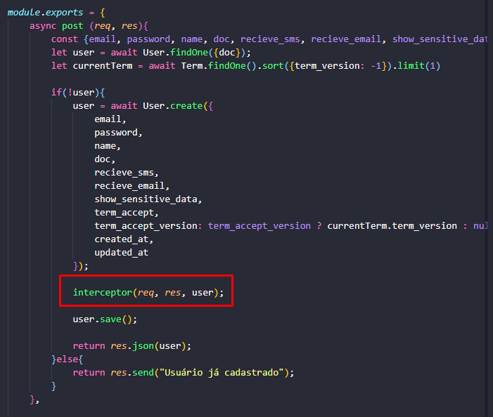

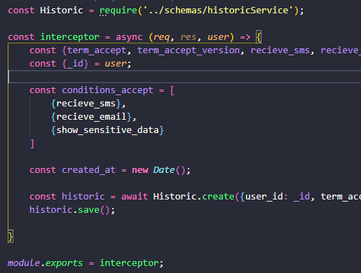

## APIs

O projeto disponibiliza APIs para seu consumo.

### GET Termo

```
<endereco_do_ambiente>/term/get/active
```

Retorna o termo ativo.

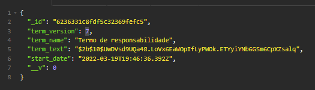

### GET Usuário

```
<endereco_do_ambiente>/users/<id>
```

Retorna o usuário por ID. Este retorno pode variar conforme a configuração do usuário. Se o usuário optar por não exibir os dados sensíveis dele, alguns dados serão mascarados no momento da consulta.

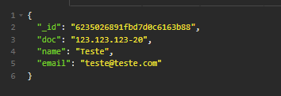


### GET Todos os usuários

```
<endereco_do_ambiente>/get/all
```

Retorna uma lista (array) com todos os usuários cadastrados.

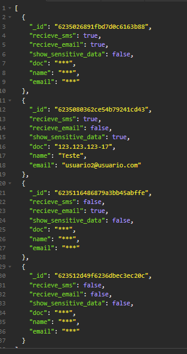

### GET Todos os históricos de alteração

```
<endereco_do_ambiente>/historics
```

Retorna uma lista (array) com todos os históricos de alterações do banco.

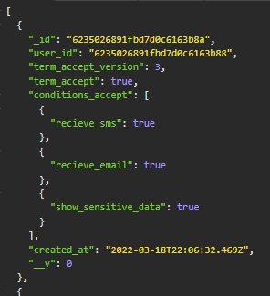

### GET Históricos de alteração por usuário

```
<endereco_do_ambiente>/historics/<id>
```

Retorna uma lista (array) com todos os históricos de alterações de um usuário do banco.

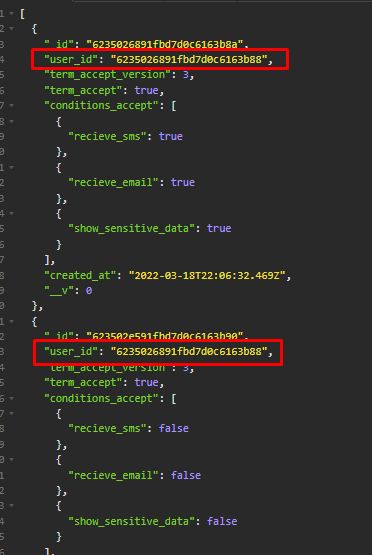


